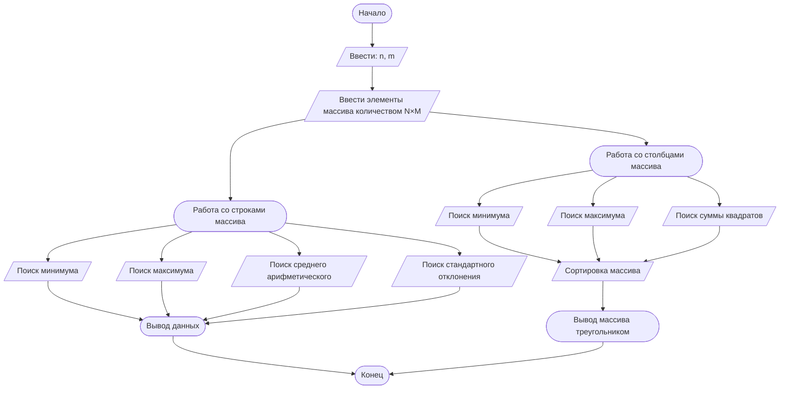

## Отчет по лабораторной работе № 2

#### № группы: `ПМ-2402`

#### Выполнил: `Балабан Даниил Вадимович`

#### Вариант: `2`

### Cодержание:

- [Постановка задачи](#1-постановка-задачи)
- [Входные и выходные данные](#2-входные-и-выходные-данные)
- [Выбор структуры данных](#3-выбор-структуры-данных)
- [Алгоритм](#4-алгоритм)
- [Программа](#5-программа)
- [Анализ правильности решения](#6-анализ-правильности-решения)

### 1. Постановка задачи

> Напишите программу на Java, которая выполняет следующие действия
с двумерным массивом целых чисел: 
> 
> 1. Считывает с консоли размеры массива N и M, затем элементы
     массива размером N ×M.
> 
> 
> 2. Переставляет столбцы массива в порядке убывания максимальных
     элементов каждого столбца. Если максимальные элементы равны,
     то сравнивает по минимальному элементу. Если минимальные эле
     менты также равны, сортирует столбцы по возрастанию суммы
     квадратов элементов столбца
> 
> 
> 3. Находит и выводит минимальное значение среди сумм элементов
    каждой строки, а также номер строки, в которой эта сумма была
    найдена.
> 
> 
> 4. Выводит элементы массива в виде треугольника, где первая строка
     содержит один элемент, вторая — три, третья — пять и так далее.
     Реализовать алгоритм с помощью одного цикла.
> 
> 
> 5. Вычисляет и выводит разницу между максимальной и минимальной суммой строк, среднее арифметическое всех сумм строк, а так
     же стандартное отклонение сумм строк


Данную задачу можно разделить на 4 части:

1 - Работа со строками (нахождение минимумов, максимумов и т.д.).

2 - Работа со столбцами (нахождение минимумов, максимумов и т.д.).

3 - Сортировка массива.

4 - Вывод массива треугольником.

### 2. Входные и выходные данные

#### Данные на вход

На вход программа должна сначала получить два числа - размеры массива, затем элементы массива размером N×M (первые 2 числа).

|                        | Тип |
|------------------------|-----|
| N (Число 1)            | Int |
| M (Число 2)            | Int |
| ... (Элементы массива) | Int |

#### Данные на выход

> Программа должна вывести: 
>
> • Отсортированный массив в виде треугольника.
> 
> • Минимальное значение среди сумм элементов каждой строки и ее номер.
>
> • Разницу между максимальной и минимальной суммой строк и среднее арифметическое всех сумм строк.
>
> • Стандартное отклонение сумм строк.


### 3. Выбор структуры данных

Программа получает только целые числа размером от `-2^31` до `2^31 - 1`. Однако произведение первых двух не должно превышать `2^31 - 1`. Все значения будут храниться в `int`.

|             | Название переменной | Тип (в Java) | 
|-------------|---------------------|--------------|
| N (Число 1) | `n`                 | `int`        |
| M (Число 2) | `m`                 | `int`        | 
| ...         | ...                 | `int`        |

### 4. Алгоритм

#### Алгоритм выполнения программы:

1. **Ввод данных:**  
   Программа считывает два целых числа, создает массив размером N×M и заполняет его входными данными.

2. **Поиск максимума строк, минимума строк, среднего арифметического сумм строк:**
   Программа пробегает по массиву, вкладывая данные в переменные.
3. **Поиск стандартного отклонения сумм строк:**  
   Используя необходимые переменные из пункта выше, при очередном пробеге по массиву, программа находит стандартное отклонение сумм строк и выводит данные за 2 и 3 пункт.
4. **Поиск максимума столбца, минимума столбца, суммы квадратов столбца:**
   Программа пробегает по массиву, вкладывая данные в переменные.
5. **Сортировка массива в соответствии с условием:**

   Программа пробегает по массиву и сортирует его по `убыванию/возрастанию` `максимальных/минимальных/сумм квадратов` элементов столбцов.
6. **Вывод массива:**

   Программа выводит массив в форме треугольника. 

#### Блок-схема



### 5. Программа

```java
import java.io.PrintStream;
import java.util.Scanner;
public class Main {
   public static Scanner in = new Scanner(System.in);
   public static PrintStream out = System.out;
   public static void main(String[] args) {
      int n = in.nextInt(), m = in.nextInt();
      int [][] a = new int[n][m];
      int [][] b = new int[3][m];
      for (int i = 0; i < a.length; i++) {
         for (int k = 0; k < a[i].length; k++) {
            a[i][k] = in.nextInt();
         }
      }
      //Поиск максимума строк, минимума строк, среднего арифметического сумм строк;
      int strmin = 0, strmax = 0, total = 0, t = 0, i1 = 0, i2 = 0;
      double otkl = 0;
      for (int st = 0; st < n - 1; st++) {
         i1 = 0;
         i2 = 0;
         for (int dm = 0; dm < m; dm++) {
            i1 += a[st][dm];
            i2 += a[st + 1][dm];
         }
         if (i1 > i2) {
            strmax = i1;
            strmin = i2;
            t = st + 2;
         }
         else {
            strmax = i2;
            strmin = i1;
            t = st + 1;
         }
      }
      for (int st = 0; st < n; st++) {
         for (int dm = 0; dm < m; dm++) {
            total += a[st][dm];
         }
      }
      //Поиск стандартного отклонения сумм строк;
      for (int st = 0, i = 0; st < n; st++) {
         for (int dm = 0; dm < m; dm++) {
            i += a[st][dm];
         }
         otkl += Math.pow(i - ((double)total / n), 2);
         i = 0;
      }
      out.printf("Минимальное значение суммы среди строк: %d\nНомер строки минимального значения: %d\n", strmin, t);
      out.printf("Разница между максимальным и минимальным значением сумм строк: %d\n", strmax - strmin);
      out.printf("Среднее арифметическое значение сумм строк: %.2f\n", (double)total / n);
      out.printf("Стандартное отклонение сумм строк: %.2f\n", Math.sqrt(otkl / n));
      out.println();

      //Поиск максимума столбца, минимума столбца, суммы квадратов столбца;
      for (int st = 0; st < m; st++) {
         int max = a[0][st], min = a[0][st];
         double sr = Math.pow(a[0][st], 2);
         for (int dm = 0; dm < n - 1; dm++) {
            if (max < a[dm + 1][st]) {
               max = a[dm + 1][st];
            }
            if (min > a[dm + 1][st]) {
               min = a[dm + 1][st];
            }
            sr = sr + Math.pow(a[dm + 1][st], 2);
         }
         b[0][st] = max;
         b[1][st] = min;
         b[2][st] = (int)(sr);
      }

      //Сортировка массива в соответствии с условием;
      for (int st = 0; st < n; st ++) {
         for (int i = 0; i < m - 1; i++) {
            for (int j = i + 1; j < m; j++) {
               if (b[0][i] < b[0][j]) {
                  int temp = a[st][i];
                  a[st][i] = a[st][j];
                  a[st][j] = temp;
               } else if (b[0][i] == b[0][j]) {
                  if (b[1][i] < b[1][j]) {
                     int temp = a[st][i];
                     a[st][i] = a[st][j];
                     a[st][j] = temp;
                  } else if (b[1][i] == b[1][j]) {
                     if (b[2][i] > b[2][j]) {
                        int temp = a[st][i];
                        a[st][i] = a[st][j];
                        a[st][j] = temp;
                     }
                  }
               }
            }
         }
      }
      //Вывод треугольником с помощью 1 цикла;
      int r1 = 0, r2 = 1, r3 = m * n, k = 0, i = 0;
      for (int p = 0; p < n * m; p++) {
         out.print(a[i][k] + " ");
         k++;
         r1++;
         r3--;
         if (r1 == r2 && r3 >= r2 + 2) {
            out.println();
            r1 = 0;
            r2 += 2;
         } else if (r1 == r2 && r3 < r2 + 2) {
            r1 = 0;
            r2 += 2;
         }
         if (k == m) {
            k = 0;
            i++;
         }
      }
   }
}
```

### 6. Анализ правильности решения

Программа работает корректно на всем множестве решений с учетом ограничений (-2<sup>31</sup> <= Переменная < 2<sup>31</sup>).

1. Тест на прямоугольном массиве:

    - **Input**:
        ```
        2 5
        6 2 1 5 7
        9 8 23 2 1
        ```

    - **Output**:
        ```
        Минимальное значение суммы среди строк: 21
        Номер строки минимального значения: 1
        Разница между максимальным и минимальным значением сумм строк: 22
        Среднее арифметическое значение сумм строк: 32,00
        Стандартное отклонение сумм строк: 11,00
        1 
        6 2 7
        5 23 9 8 1 2
        ```

2. Тест на квадратном массиве:

    - **Input**:
        ```
        5 5
        2 1 3 8 4
        3 4 9 16 4
        3 4 0 8 52
        2 3 9 8 6 
        6 6 63 2 6
        ```

    - **Output**:
        ```
        Минимальное значение суммы среди строк: 28
        Номер строки минимального значения: 4
        Разница между максимальным и минимальным значением сумм строк: 55
        Среднее арифметическое значение сумм строк: 46,40
        Стандартное отклонение сумм строк: 24,57
        4 
        8 1 3
        2 4 16 4 9
        3 52 8 4 0 3 6
        8 3 9 2 6 2 6 63 6
        ```

3. Тест на массиве с одинаковыми значениями:

    - **Input**:
        ```
        4 4
        4 4 4 4
        4 4 4 4 
        4 4 4 4
        4 4 4 4 
        ```

    - **Output**:
        ```
        Минимальное значение суммы среди строк: 16
        Номер строки минимального значения: 3
        Разница между максимальным и минимальным значением сумм строк: 0
        Среднее арифметическое значение сумм строк: 16,00
        Стандартное отклонение сумм строк: 0,00
        4 
        4 4 4
        4 4 4 4 4
        4 4 4 4 4 4 4
        ```

4. Тест на массиве с большими значениями:

    - **Input**:
        ```
        6 6 
        383 928 392 832 932 999
        544 7766 333 6 643 6890
        333 543 88888 4332 44 0
        212 33 5555 245 789 322
        9991 83928 10000 3 213 1
        9 3 11 312 922 10000000 
        ```

    - **Output**:
        ```
      Минимальное значение суммы среди строк: 104136
      Номер строки минимального значения: 5
      Разница между максимальным и минимальным значением сумм строк: 9897121
      Среднее арифметическое значение сумм строк: 1704556,17
      Стандартное отклонение сумм строк: 3710617,89
      999 
      392 928 383
      832 932 6890 333 7766
      544 6 643 0 88888 543 333
      4332 44 322 5555 33 212 245 789 1
      10000 83928 9991 3 213 10000000 11 3 9 312 922
        ```